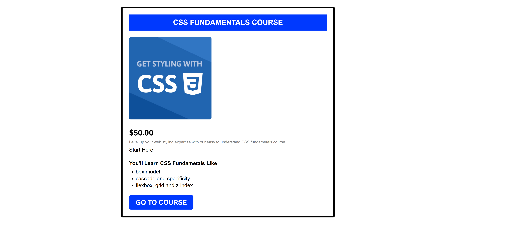
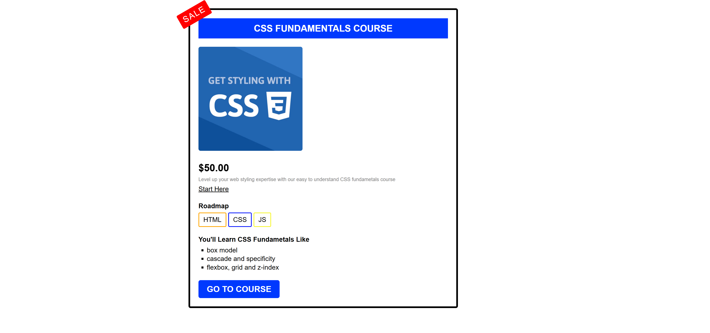

# 🎨 CSS Challenges (Course Projects)

This repository contains my **practice projects** from the course:

🎓 **[CSS Fundamentals](https://almdrasa.com/tracks/frontend/courses/css-fundamentals/)** offered by [Almdrasa](https://almdrasa.com)

By completing these challenges, I practiced the **core CSS concepts** while styling real mini-projects.  
This course is essential for building strong styling skills in **Frontend Development**.

---

## 🧠 Project Overview

The folder contains **3 challenge projects**:  

* **CHALLENGE #1** → Basic styled course card (HTML + CSS)  
* **CHALLENGE #2** → Centered layout with improved spacing  
* **CHALLENGE #3** → Course card with sale badge & roadmap  

---

## 📂 Files in the Repository

| Folder         | Description |
| -------------- | ----------- |
| `CHALLENGE #1` | Includes `index.html`, `style.css`, and `images/` |
| `CHALLENGE #2` | Includes `index.html`, `style.css`, and `images/` |
| `CHALLENGE #3` | Includes `index.html`, `style.css`, and `images/` |

---

## 🚀 Features

* ✅ **Reusable CSS classes** for typography, colors, and layout  
* ✅ Styled buttons and links with hover effects  
* ✅ Use of **box model**, **margins/padding**, **border radius**  
* ✅ Centered layouts with `margin: auto`  
* ✅ Custom "Sale" badge using **position & transform**  
* ✅ Mini Roadmap section styled with colored borders  

---

## 🎯 What I Learned

* CSS **selectors** and how they cascade  
* Styling text, lists, links, and buttons  
* Working with **flexbox/grid basics**  
* Using **position** to create creative badges  
* Improving layout with **margins, padding, and container widths**  

---

## 🧰 Tech Stack

* `HTML5`  
* `CSS3`

---

## 📸 Project Previews

### 🔹 Challenge #1 – Basic Styled Card

### 🔹 Challenge #2 – Centered Layout

### 🔹 Challenge #3 – Sale Badge + Roadmap

---

## ✅ Run the Project

Just open any `index.html` file inside the challenge folders in your browser.

---

👨‍💻 Created by [**Nabil El Amrawy**](https://www.linkedin.com/in/nabil-el-amrawy/) during the CSS course practice.
"# Css-fundamentals-challenges" 
